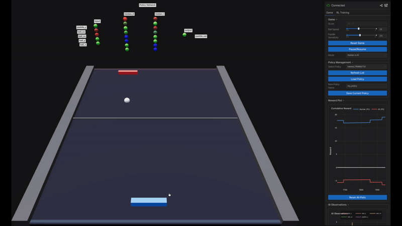

# The Reinforce Game

An interactive Pong game featuring real-time reinforcement learning, MuJoCo physics simulation, and live neural network visualization — all in your browser.

<p align="center">
  
</p>

## Features

- **Play Against AI** — Control your paddle with the mouse and compete against a trained RL agent
- **Train in Real-Time** — Watch PPO learn to play Pong with live training metrics
- **Neural Network Visualization** — See policy network activations update in real-time as the AI makes decisions
- **MuJoCo Physics** — Realistic ball and paddle physics with proper collision handling
- **Browser-Based UI** — Modern interface powered by Viser with interactive controls and plots

## Quick Start

### Prerequisites

- Python 3.10+
- [uv](https://github.com/astral-sh/uv) (recommended) or pip

### Installation

```bash
# Clone the repository
git clone https://github.com/yourusername/TheReinforceGame.git
cd TheReinforceGame

# Install dependencies with uv
uv sync

# Or with pip
pip install -e .
```

### Run the Game

```bash
# With uv
uv run pong

# Or directly
python -m src.visualization.viser_app
```

Open **http://localhost:8080** in your browser.

## How to Play

1. **Move your paddle** — Click and drag on the left side of the table
2. **Score points** — Get the ball past the AI's paddle on the right
3. **First to 11 wins** — Classic Pong rules

## Training Your Own Agent

1. Navigate to the **RL Training** tab in the sidebar
2. Adjust hyperparameters:
   - Learning Rate
   - Discount Factor
   - PPO Clip Range
   - Network Architecture
3. Set the number of training timesteps
4. Click **Start Training**
5. Watch the training progress with live reward plots

Trained policies are automatically saved to the `policies/` directory.

## Architecture

```
src/
├── core/
│   ├── constants.py      # Game configuration
│   ├── game_state.py     # Shared state management
│   └── physics_engine.py # MuJoCo physics wrapper
├── environment/
│   └── pong_env.py       # Gymnasium environment for RL
├── agents/
│   ├── rl_trainer.py     # PPO training manager
│   └── policy_manager.py # Save/load policies
└── visualization/
    ├── viser_app.py      # Main application
    ├── scene_renderer.py # 3D scene rendering
    ├── gui_panels.py     # UI controls
    ├── network_visualizer.py  # Neural network display
    ├── reward_plotter.py      # Gameplay reward plots
    └── training_plotter.py    # Training metrics plots
```

## Tech Stack

| Component | Technology |
|-----------|------------|
| Physics | [MuJoCo](https://mujoco.org/) 3.2+ |
| Visualization | [Viser](https://github.com/nerfstudio-project/viser) |
| RL Algorithm | [Stable-Baselines3](https://stable-baselines3.readthedocs.io/) PPO |
| Environment | [Gymnasium](https://gymnasium.farama.org/) |
| Deep Learning | [PyTorch](https://pytorch.org/) |
| Plotting | [Plotly](https://plotly.com/python/) |

## Observation Space

The RL agent receives a 5-dimensional observation:

| Index | Feature | Range |
|-------|---------|-------|
| 0 | Ball X position | [-1.2, 1.2] |
| 1 | Ball Y position | [-0.9, 0.9] |
| 2 | Ball X velocity | [-2.0, 2.0] |
| 3 | Ball Y velocity | [-2.0, 2.0] |
| 4 | Own paddle Y | [-0.65, 0.65] |

The agent does **not** observe the opponent's paddle position.

## Reward Structure

| Event | Reward |
|-------|--------|
| Score a point | +1.0 |
| Concede a point | -1.0 |
| Track ball | +0.001 × alignment |

## License

MIT

---

<p align="center">
  Built with reinforcement learning
</p>
